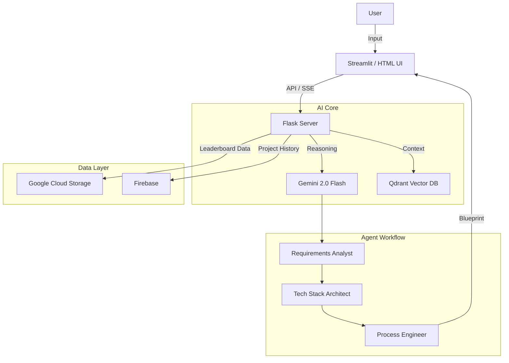

# GenAI Project Studio

**"Architect your dreams with AI."**

GenAI Project Studio is a full-stack intelligent application designed to streamline the software engineering lifecycle. It combines the power of **Google Gemini**, **Vector Search (RAG)**, and **Agentic Workflows** to help developers choose the right tools and design complex systems instantly.

## Features

### 🔍 Perfect Model Finder

- **Smart Classification**: Automatically detects if a task requires an LLM (Generative) or Traditional ML (Predictive).
- **Benchmark-Driven**: Recommends models based on specific metrics (MMLU, HumanEval, GSM8K) relevant to the user's task.
- **Code Generation**: Provides ready-to-use Python inference code for every recommended model.

### ✨ Project Architect (AI Crew)

- **Agentic Workflow**: Orchestrates a team of AI agents (Analyst → Architect → Engineer) to design software.
- **RAG Integration**: Uses **Qdrant** to retrieve up-to-date tech stack definitions, reducing hallucinations.
- **Real-time Streaming**: Streams the AI's reasoning process and logs to the UI.
- **Comprehensive Blueprints**: Generates Executive Summaries, Tech Stacks, File Trees, and Implementation Guides.

### 💾 Cloud Integration

- **History**: Saves generated projects to **Firebase Firestore**.
- **Data Pipeline**: Fetches live leaderboard data from **Google Cloud Storage**.
- **Analytics**: Logs user feedback to **BigQuery**.

## System Architecture



## Prerequisites

- Python 3.10+
- Google Cloud Project (for Firestore, Storage, BigQuery)
- Gemini API Key
- Docker (Optional)

## Setup

### 1. Clone & Install

```bash
git clone https://github.com/SaiGayathriGudla-1184/Gen-ai-project-architect.git
cd Gen-ai-project-architect
pip install -r requirements.txt
```

### 2. Configuration

Create a `.env` file in the root directory:

```ini
GEMINI_KEY=your_api_key_here
BUCKET_NAME=genai-architect-data-2026
```

Place your Google Cloud Service Account key as `service-account-key.json` in the root directory.

### 3. Running the App

**Option A: Using Docker (Recommended)**
This runs both the Flask Backend and the Streamlit Frontend in a single container.

```bash
docker build -t genai-architect .
docker run -p 8080:8080 --env-file .env genai-architect
```

Access the app at `http://localhost:8080`.

**Option B: Local Development**
Run the backend and frontend separately.

*Terminal 1 (Backend):*

```bash
python server.py
```

*Terminal 2 (Frontend):*

```bash
streamlit run app.py
```

**Locally:**

1. Run `python server.py` to start the backend.
2. Run `streamlit run app.py` to start the frontend (if using Streamlit UI) or access `http://localhost:8080` for the HTML UI.
